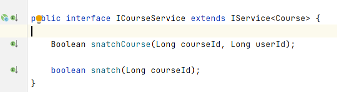
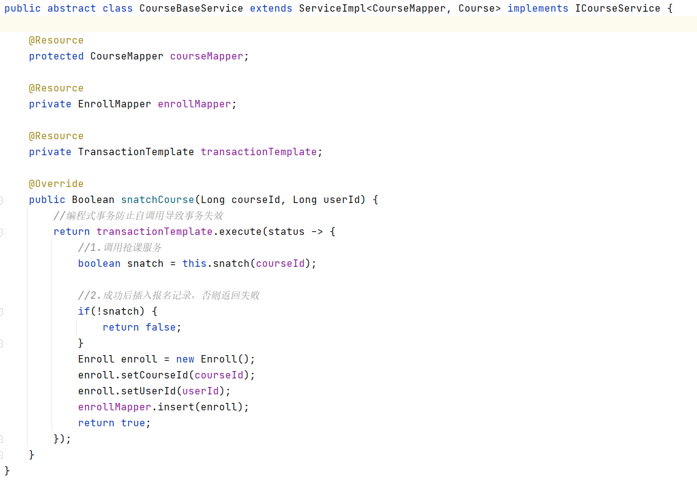

# qiangke
一个抢课的小Demo，可以用来作为学校教务网抢选修课业务的参考示例，支持MySQL，Redis分布式锁，Redis滑动库存，Lua脚本等方案实现，开发者可根据业务的并发度来决定使用的具体方案。

## 实现方案
对于解决抢课中的库存超卖问题，业界有N种实现方式，其实本质上大相径庭，主要思路就是将多线程的并发操作变成排队执行，
通过排队执行，防止多个线程指令交错导致的并发问题，而对于如何使操作变成排队执行，各种方案对应的性能也不同。

我提供了四种实现方式，开发者可根据自身业务情况以及公司技术栈 来使用对应的方案，个人比较推荐滑动库存的方式实现。
### MySQL行锁
由于MySQL update自带行锁，所以可以保证多线程并发操作时排队执行。
### 滑动库存
通过Redis incr命令，将扣减库存的操作变成原子性的操作，保证一个库存数量只会被一个用户占有，
并通过命令执行之后返回的当前已用库存， 通过判断当前已用库存和总库存，来判断是否抢课成功。

正常情况下，incr命令能保证每个用户获取的库存值不同，
但是该方式在某些极端情况下，可能会导致incr命令返回重复的数字，
比如*主备切换*、*同步延迟*、*数据恢复*、*库存修改*等问题，造成Redis value回拨，从而发生超卖问题。
而解决这个问题也很简单，我们只需要通过Redis对每一段库存加一个分布式锁，就可以完全避免掉这个问题，
并且，由于此处加锁的粒度很细，锁级别是针对的每一个库存量，不会对性能造成较大的影响。
### 分布式锁
抢课这个步骤分为几步
* 获取库存
* 判断是否大于0
* 扣减库存

我们只需要通过分布式锁将这几步变成同步执行即可，就保证了分布式环境下的串行执行。

不过这种方案会出现库存剩余的问题，所以不太推荐。
### Lua脚本
Lua脚本可以使多个Redis命令变成一段脚本，Redis服务器会单线程原子性的执行lua脚本，
通过lua脚本，将判断和扣减的操作变成一个原子操作，这样就避免了并发问题。

## 核心代码

`ICourseService`接口,定义了抢课方法

`com.github.jjjzzzqqq.qiangke.service.impl.CourseBaseService`抽象模板类Service，
定义了抢课执行的大体流程，通过模板方法设计模式，将实现延迟到子类完成。

`com.github.jjjzzzqqq.qiangke.service.impl.CourseServiceMysqlImpl`MySQL行锁实现

`com.github.jjjzzzqqq.qiangke.service.impl.CourseServiceRedisImpl`滑动库存实现

`com.github.jjjzzzqqq.qiangke.service.impl.CourseServiceLuaImpl`Lua脚本实现

`com.github.jjjzzzqqq.qiangke.service.impl.CourseServiceLockImpl`分布式锁实现